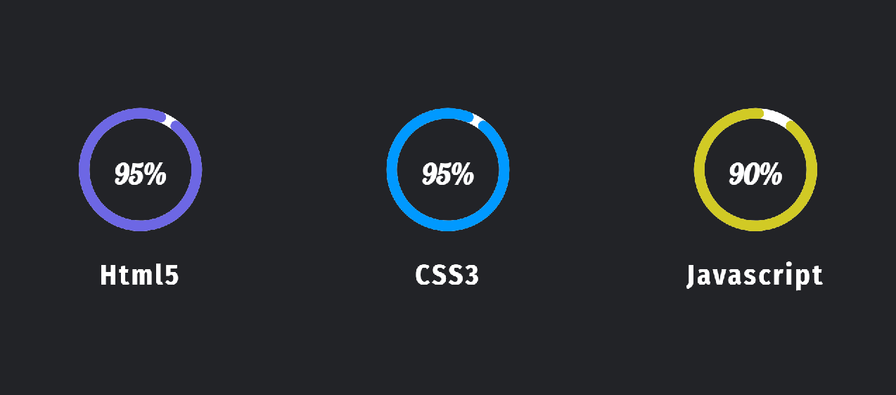

# Dynamic Circular Progress Bar Only ( HTML5 & CSS3 & Javascript ) no plugin use |

----------

[video-link]()

----------




----------

# Code Snippets

## HTML5
``` html
<!DOCTYPE html>
<html lang="en">
  <head>
    <meta charset="UTF-8" />
    <meta http-equiv="X-UA-Compatible" content="IE=edge" />
    <meta name="viewport" content="width=device-width, initial-scale=1.0" />
    <title>circular progress bar</title>
    <link rel="stylesheet" href="style.css" />
  </head>
  <body>
    <div class="container">
      <div class="circle_box">
        <div class="box">
          <div class="skill">
            <svg>
              <circle cx="100" cy="100" r="80"></circle>
              <circle
                class="progress"
                cx="100"
                cy="100"
                r="80"
                data-value="95"
                data-stroke="#6d67e4"
              ></circle>
            </svg>
            <span class="data-progress" data-value="95"></span>
          </div>
          <strong>Html5</strong>
        </div>
        <div class="box">
          <div class="skill">
            <svg>
              <circle cx="100" cy="100" r="80"></circle>
              <circle
                class="progress"
                cx="100"
                cy="100"
                r="80"
                data-value="95"
                data-stroke="#0099ff"
              ></circle>
            </svg>
            <span class="data-progress" data-value="95"></span>
          </div>
          <strong>Html5</strong>
        </div>
        <div class="box">
          <div class="skill">
            <svg>
              <circle cx="100" cy="100" r="80"></circle>
              <circle
                class="progress"
                cx="100"
                cy="100"
                r="80"
                data-value="80"
                data-stroke="#d1ca25"
              ></circle>
            </svg>
            <span class="data-progress" data-value="80"></span>
          </div>
          <strong>Javascript</strong>
        </div>
      </div>
    </div>
    <script src="script.js"></script>
  </body>
</html>
```
## CSS3
``` css
@import url('https://fonts.googleapis.com/css2?family=Pushster&display=swap');
@import url('https://fonts.googleapis.com/css2?family=Fira+Sans+Condensed:wght@700&display=swap');
*,
*:after,
*:before {
  box-sizing: border-box;
  margin: 0;
  padding: 0;
}
:root {
  --bg: #222327;
  --transition: stroke-dashoffset 0.5s cubic-bezier(0.175, 0.885, 0.32, 1.275)
    forwards;
  --font-1: 'Pushster', cursive;
  --font-2: 'Fira Sans Condensed', sans-serif;
  --white: #fff;
}

body {
  font-size: 62.5%;
  background: var(--bg);
}
.container {
  margin: 0 auto;
  max-width: 114rem;
  width: calc(100% - 2rem);
  padding: 0 1rem;
  height: 100vh;
}
.circle_box {
  width: 100%;
  height: 100%;
  position: relative;
  padding-top: 9rem;
  display: grid;
  grid-template-columns: repeat(auto-fit, minmax(270px, 1fr));
  gap: 6rem;
  font-size: 2.5rem;
  color: var(--white);
  text-align: center;
}
.circle_box .box {
  width: 100%;
  display: flex;
  gap: 1rem;
  flex-direction: column;
}
.skill {
  position: relative;
}
svg {
  width: 200px;
  height: 200px;
  transform: rotate(309deg);
  overflow: initial;
  transform-origin: center;
}
circle {
  stroke-width: 15px;
  fill: none;
  transition: all 0.5s ease;
}
circle:nth-child(1) {
  stroke: var(--white);
}
.progress {
  stroke: var(--stroke);
  position: relative;
  z-index: 1;
  transition: var(--transition);
  stroke-dasharray: var(--stroke-dasharray);
  stroke-dashoffset: var(--stroke-dasharray);
  animation: progress var(--animation-time) ease-in forwards;
  --webkit-stroke-position: inside;
  stroke-linecap: round;
}
@keyframes progress {
  to {
    stroke-dashoffset: var(--stroke-dashoffset);
  }
}
.skill .data-progress {
  font-family: var(--font-1);
  position: absolute;
  color: var(--white);
  font-size: 40px;
  font-weight: bold;
  left: 50%;
  top: 50%;
  transform: translate(-50%, -50%);
}
.box strong {
  letter-spacing: 0.2rem;
  font-family: var(--font-2);
}
```
## Javascript
``` javascript
let progress = document.querySelectorAll('.progress');
let progress_text = document.querySelectorAll('.data-progress');
progress.forEach((pro) => {
  let percentage = pro.getAttribute('data-value');
  let color = pro.getAttribute('data-stroke');
  let radius = pro.r.baseVal.value;
  let circumference = radius * 2 * Math.PI;
  let stroke = circumference - (circumference * percentage) / 100;
  pro.style.setProperty('--stroke-dashoffset', stroke);
  pro.style.setProperty('--stroke-dasharray', circumference);
  pro.style.setProperty('--stroke', color);
  pro.style.setProperty('--animation-time', `${percentage * 100}ms`);
});
progress_text.forEach((text) => {
  let data = text.getAttribute('data-value');
  let progress_value = 0;
  let progress_bar = setInterval(() => {
    progress_value++;
    text.innerText = `${progress_value}%`;
    if (progress_value == data) {
      clearInterval(progress_bar);
    }
  }, 100);
});
```